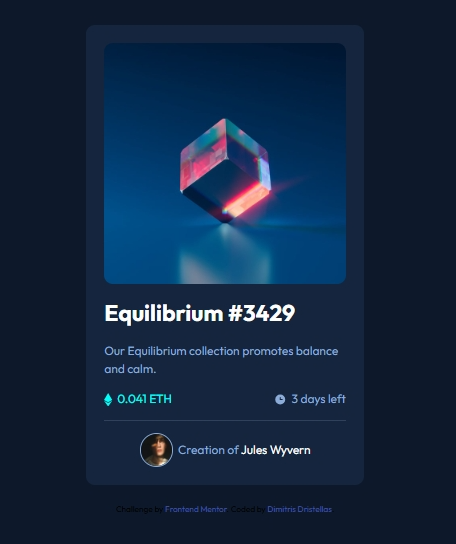

# Frontend Mentor - NFT preview card component solution

This is a solution to the [NFT preview card component challenge on Frontend Mentor](https://www.frontendmentor.io/challenges/nft-preview-card-component-SbdUL_w0U). Frontend Mentor challenges help you improve your coding skills by building realistic projects. 

## Table of contents

- [Overview](#overview)
  - [The challenge](#the-challenge)
  - [Screenshot](#screenshot)
  - [Links](#links)
- [My process](#my-process)
  - [Built with](#built-with)
  - [What I learned](#what-i-learned)
- [Author](#author)

*

## Overview

### The challenge

Users should be able to:

- View the optimal layout depending on their device's screen size
- See hover states for interactive elements

### Screenshot



### Links

- Solution URL: [Add solution URL here](https://github.com/dimitrisdr/nft-preview-card-component.git)
- Live Site URL: [Add live site URL here](https://your-live-site-url.com)

## My process

### Built with

- Semantic HTML5 markup
- CSS custom properties
- Flexbox
- CSS Grid
- Mobile-first workflow

### What I learned

```css
.img-container {
    position: relative;
    cursor: pointer;
}

.img-container::after {
    content: url('images/icon-view.svg');
    position: absolute;
    inset: 0;
    background-color: var(--Cyan-transparent);
    border-radius: inherit;
    display: grid;
    place-items: center;
    transform: scale(0,1);
    transform-origin: left;
    opacity: 0;
    transition: transform 0.2s ease-in, opacity 0.4s ease-in;
}

.img-container:hover::after {
    transform: scale(1, 1);
    opacity: 1;
}
```


### Useful resource

## Author

- Frontend Mentor - [@yourusername](https://www.frontendmentor.io/profile/dimitrisdr)